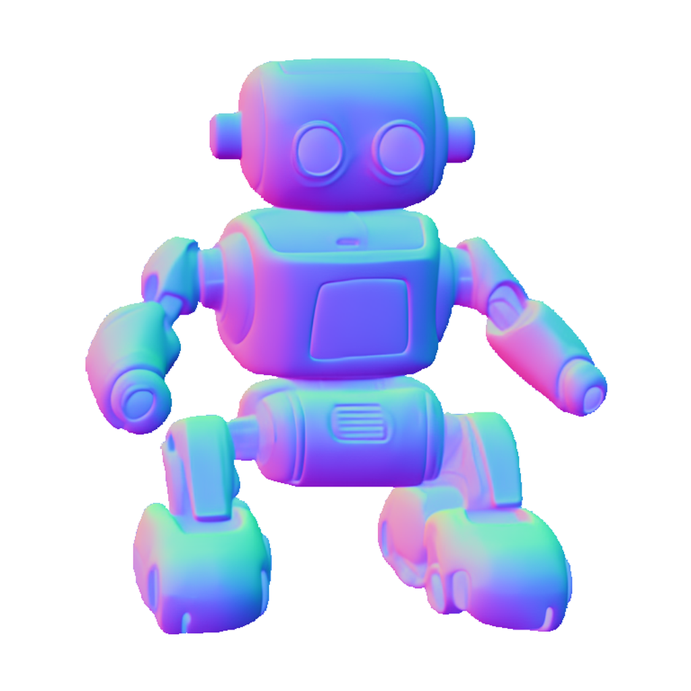
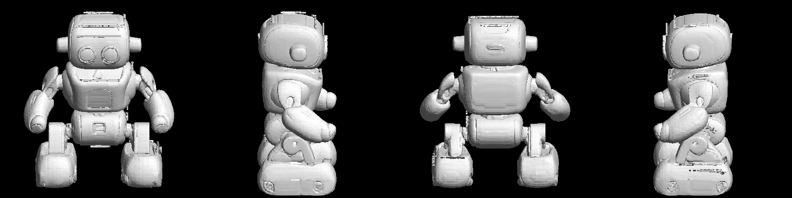

# hi3dgen-strix-halo

[](https://github.com/kroqueta-s/hi3dgen-strix-halo/actions/workflows/test.yml)

**[Hi3DGen / Stable3DGen](https://github.com/Stable-X/Stable3DGen) image-to-mesh
on AMD Strix Halo (gfx1151), Windows, ROCm — with no CUDA-only package
installed.**

Hi3DGen goes image → normal map → mesh. Upstream needs `spconv` and `xformers`,
neither of which exists for Windows + ROCm. This repository supplies pure-torch
replacements that are injected at launch time, so **upstream code is cloned and
run unmodified**.

The runner speaks one JSON object per line over stdin/stdout, so any
orchestrator can drive it as a child process. It also runs standalone (see
Quickstart).

| Input image | Normal map (intermediate) | Mesh (4 views) |
|---|---|---|
|  |  |  |

*The bundled [`assets/sample.png`](assets/sample.png) (an SDXL-generated robot)
is the reference specimen for the measurements below.*

## Prerequisites

- Windows 11
- Git
- An AMD GPU supported by ROCm on Windows (verified on **Strix Halo / gfx1151**,
  Radeon 8060S)
- AMD Adrenalin driver with **ROCm 7.2.1** support
- **Python 3.12**
- ~15 GB of disk (venv + upstream clone + 5.4 GB of weights)
- ~17 GB of free VRAM at peak

## Install

```powershell
git clone https://github.com/kroqueta-s/hi3dgen-strix-halo
cd hi3dgen-strix-halo
.\install.ps1
```

That creates a virtual environment, installs ROCm PyTorch, clones upstream at a
pinned commit, downloads the weights (5.4 GB across three repositories), writes
`.env`, and **verifies the replacements against exact references** before you
trust any mesh. If PowerShell refuses to run the script, use
`powershell -ExecutionPolicy Bypass -File .\install.ps1`.

## Quickstart

Generate a mesh from the bundled sample, no JSON required:

```powershell
.venv\Scripts\python.exe tools\run_single.py --image assets\sample.png --out C:\out
```

The mesh lands in `C:\out\raw.ply`. Progress streams to the console, with a bar
for every stage whose steps can be counted:

```
[   32.1s] structure  [############------------]  50%  (25/50)
[   58.4s] slat       [####--------------------]  16%  (1/6)
```

**The percentage is counted, never estimated**, and there is no ETA on purpose:
on this hardware the first run of a loop can be an order of magnitude slower
than every run after it, so a prediction would mislead exactly when it mattered.
Stages whose length is not known report a step number and nothing more.

To reproduce the benchmark below, run the same command **twice and time the
second run**: the first run includes MIOpen's one-time convolution tuning, which
can add several minutes and says nothing about steady-state speed.

## Use

```powershell
.venv\Scripts\python.exe -m runners.hi3dgen
```

```json
{"id": 1, "method": "capabilities"}
{"id": 2, "method": "image_to_mesh", "params": {"image_path": "C:/in.png", "out_dir": "C:/out"}}
```

`image_to_mesh` writes `raw.ply` plus the intermediate `foreground.png` and
`normal.png`. Parameters: `ss_steps`, `slat_steps`, `ss_guidance`,
`slat_guidance`, `seed`.

## What is replaced, and why it is safe

| Upstream dependency | Replacement | Verified by |
|---|---|---|
| `spconv` (sparse conv) | `runners/hi3dgen/shims.py` — submanifold convolution in torch | Exact agreement with a dense `F.conv3d` reference |
| `xformers` / `flash_attn` | Same file — `F.scaled_dot_product_attention` | Agreement with a naive attention reference |

```powershell
.venv\Scripts\python.exe tests\test_shims.py
```

Submanifold convolution is exactly a dense convolution restricted to occupied
voxels, so it can be checked against a reference without the original library.

## Two pins you must not float

- **`diffusers==0.31.0`** — StableNormal imports `diffusers.models.controlnet`,
  moved in 0.32 and absent in 0.40.
- **`transformers==4.46.3`** — diffusers 0.31 imports `FLAX_WEIGHTS_NAME`,
  removed in transformers 5.

## The GPU idles at 600 MHz unless something renders

The AMD Windows driver does not raise the GPU power state for compute-only
work: at 99 % compute utilisation the clock sits at **600 MHz** (measured,
2026-09-01). With any 3D rendering alive alongside, the same workload sustains
**2.3–2.9 GHz** — a 4.3× difference on GEMM throughput. This also means
generation time swings wildly depending on whether some UI happens to be
animating on the desktop.

The runner therefore keeps a **hidden 3D render loop** (`gfxlight.py`, pure
ctypes, ~0.4 % of the 3D engine) alive during `image_to_mesh`. It is on by
default (`HI3DGEN_GFX_KEEPALIVE`), costs nothing measurable, and whether it was
alive is reported in `metrics.gfx_keepalive`.

## Measurements (gfx1151, Radeon 8060S, 32 GB dedicated VRAM)

One image (`assets/sample.png`), upstream defaults `ss_steps = 50`,
`slat_steps = 6`, clock keepalive on, 2026-09-02:

| Stage | Time |
|---|--:|
| Load weights (3D + BiRefNet + StableNormal) | 26 s |
| Background removal (BiRefNet) | 5 s |
| Normal estimation (StableNormal) | 3 s |
| Sparse structure | 44 s |
| Structured latent | 16 s |
| Decode to mesh | 4 s |
| **Generate total** | **65 s** |

Peak VRAM 16.2 GB. Output 830,870 faces after post-processing (hole filling
plus dropping free-floating debris).

**The first run is much slower**: MIOpen tunes convolution kernels once, which
took 793 s for normal estimation and 165 s for background removal. The second
run took 1.7 s and 3.4 s for the same stages. Do not judge speed from the first
run.

Attention is 10–20× faster when `TORCH_ROCM_AOTRITON_ENABLE_EXPERIMENTAL=1` is
set **before** torch is imported. The runner sets it for you.

## Troubleshooting

- **Out of VRAM.** The runner caps torch at `HI3DGEN_VRAM_LIMIT_GB` (default
  30 GB) so that overflow fails fast as `torch.OutOfMemoryError` instead of
  silently spilling into shared memory and becoming several times slower. If
  you hit it, close other GPU consumers (check dedicated-VRAM usage in Task
  Manager's Performance tab) or lower `ss_steps`; peak use for the defaults is
  about 17 GB.
- **The first run looks hung.** It is not. MIOpen tunes convolution kernels
  once per machine (measured: 793 s inside normal estimation, with the GPU
  busy). Do not kill it; every later run reuses the tuned kernels and the same
  stage takes seconds. The runner emits a `heartbeat` line every 10 s — as long
  as those keep coming, it is working.

## Limits

- **No texture.** Upstream produces geometry only.
- **The mesh is clipped at the top of the generation volume.** Measured on one
  sample, all four boundary loops lay on a single plane at the top. Upstream
  frames the subject at 1.2× its bounding box and that is not adjustable from
  outside. The runner closes those openings with `pymeshfix`, the same call
  upstream TRELLIS uses for the same purpose.
- **Free-floating parts.** Measured on one sample, 941 of 968 stray parts were
  outside the body. Upstream has no post-processing at all, so the runner drops
  detached parts that are **small** (below 10 % of the model's longest side,
  `HI3DGEN_DROP_SMALL_PARTS`) or **paper-thin** (min bbox extent below 2 %,
  `HI3DGEN_DROP_THIN_PARTS`) — the thin ones are surface-hugging flakes up to
  29 % long that pass the size test but render as dark speckles. Measured
  margins: flakes ≤ 1.4 % thick, real detached parts (arms, panels) ≥ 11.8 %.
  How much was dropped is always recorded. Set either to 0 to disable.
- Generation time on this hardware depends on the GPU power state (see the
  600 MHz section above). The keepalive pins the fast case, but do not use
  wall-clock time as a pass/fail signal.

## License

MIT (see [LICENSE](LICENSE)). Upstream Stable3DGen is MIT. Weights:
`Stable-X/trellis-normal-v0-1` MIT, `ZhengPeng7/BiRefNet` MIT,
`Stable-X/yoso-normal-v1-8-1` Apache-2.0. This repository contains no upstream
code and no weights.
